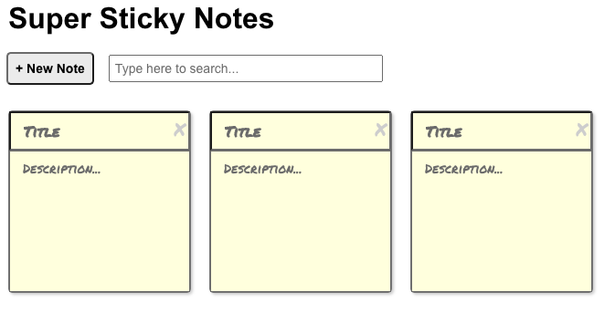

# Super Sticky Notes
A simple sticky notes app built with React JS. 

## About
Super Sticky Notes is an interactive web application that lets users:

- Create new sticky notes
- Edit notes
- Delete notes
- Search through their notes

The app saves data between sessions to the brower's local storage. This prevents current sticky notes and their contents from disappearing when the browser is closed, and users will be able to see their notes when they re-open the browser.    

## Project Background
The Super Sticky Notes app was a project I completed as course work for Skillcrush's "Introduction to JavaScript React" course. 

The project focused on how to build React code from scratch for an interactive web application that handles dynamic content based on user input. Learnings included: 

- How to break the user interface (UI) into components, code a static version of the UI, and decompose the static UI into separate (stateful and functional) components.

- How to make the UI interactive by managing the data flow between components - incl. choosing data models, assigning data to components, and passing props - and updating state with event handlers, and adding event listeners.  

- How to save data to the browser's local storage using life cycle components. 

## Built With 
- React.js
- ES6 
- JSX
- CSS3
- HTML5

## Acknowledgements

**Skillcrush** - I coded the Super Sticky Notes app's React files with support and guidance from Skillcrush. The app's HTML and CSS files and their contents were provided by Skillcrush.  